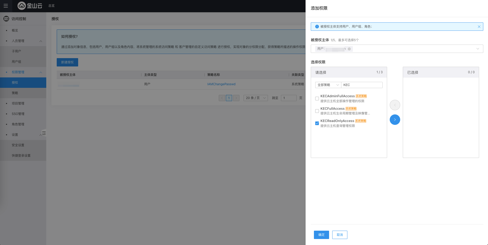

# 金山云监控 Exporter

通过kingsoft cloud exporter将云监控支持的产品监控指标自动批量导出  

## 一、支持的产品列表
产品     | 命名空间 |支持的指标|
--------|---------|----------
云服务器 | KEC |[指标详情](https://docs.ksyun.com/documents/26#one)
裸金属服务器 | EPC |[指标详情](https://docs.ksyun.com/documents/26#ten)
弹性IP  | EIP |[指标详情](https://docs.ksyun.com/documents/26#two)
NAT    | NAT |[指标详情](https://docs.ksyun.com/documents/26#three)
负载均衡 | SLB |[指标详情](https://docs.ksyun.com/documents/26#six)
4层监听器 | LISTENER |[指标详情](https://docs.ksyun.com/documents/26#seven)
7层监听器 | LISTENER7 |[指标详情](https://docs.ksyun.com/documents/26#seven)
对等连接 | PEER |[指标详情](https://docs.ksyun.com/documents/26#eight)
共享带宽 | BWS |[指标详情](https://docs.ksyun.com/documents/26#nine)
专线网关 | DCGW|[指标详情](https://docs.ksyun.com/documents/26#seventeen)
关系型数据库 | KRDS |[指标详情](https://docs.ksyun.com/documents/26#five)
云数据库Redis | KCS |[指标详情](https://docs.ksyun.com/documents/26#four)

`后续会有更多的产品支持`

**监控项说明:**

- 云服务器（KEC）监控项
  - 网卡入包速率 (`net.if.in[eth0,packets]`)，监控项转为 (`net.if.in.pps`)
  - 网卡出包速率 (`net.if.out[eth0,packets]`), 监控项转为 (`net.if.out.pps`)


## 二、快速开始

### 1.构建

1.使用 `make` 方式：
```shell
$ git clone https://github.com/KscSDK/kingsoftcloud-exporter.git

$ make
```


2.使用 `go build` 方式构建：（`go version 1.18+`）
```shell
$ git clone https://github.com/KscSDK/kingsoftcloud-exporter.git

$ go build cmd/ksc-exporter/ksc_exporter.go
```

或从release列表获取预编译的二进制。

### 2. 配置

配置中主要分为如下两块：
- 云API的 `credential` 认证信息
- 产品`products`指标、实例导出信息

可在Git仓库中 `examples` 文件里, 找到含有支持的产品配置模版样例，用作参考。

配置参数说明如下：

```yaml
// 云监控拉取指标数据限制, 官方默认限制最大20qps
rate_limit: 15                                   

// 授权配置
credential:
  access_key: <YOUR_ACCESS_KEY>                  // 必须, 云API的SecretId
  secret_key: <YOUR_ACCESS_SECRET>               // 必须, 云API的SecretKey
  region: <REGION>                               // 必须, 实例所在区域信息

// 整个产品纬度配置, 每个产品一个item
// 特别注意： 如果产品下有大量实例资源，不建议一次配置多个产品线
//          目前限制一个Exporter最多配置4个产品
product_conf:
  - namespace: KEC
    only_include_metrics:                          // 可选, 只导出这些指标
      - system.cpu.load
      - net.if.out
    only_include_projects: [104139]                // 可选, 只导出该项目制下的资源
    only_include_instances:                        // 可选, 只导出指定实例的监控，当配置时 `only_include_projects` 失效
      - "1b4aaa4d-1381-4f34-b312-ed353c6b45d9"
      - "470d384e-9df9-4b63-aa22-f60bc97e6502"
    reload_interval_minutes: 60                    // 可选, 周期reload实例列表, 建议频率不要太频繁
```


**特殊说明:**

1. **credential.access_key**
   申请方式，请参考[访问控制](https://docs.ksyun.com/documents/1376)，**特别需要注意:** 当前账号必须要有访问对应云服务产品线的权限；

   可参考 [全局系统策略](https://docs.ksyun.com/documents/1398)；

   示例1：**`Exporter`** 使用未授权的账号获取云服务器(KEC)监控，配置如下:
   ```yaml
      credential:
        access_key: XXXX-XXXX
        secret_key: XXXX-XXXX
        region: cn-beijing-6
      
      product_conf:
        - namespace: KEC
   ```
   运行 **`Exporter`** 失败，提示错误如截图所示，表示当前账户无权限访问云服务器(KEC)资源列表;
   
   
   此时需要登录，[访问控制台](https://uc.console.ksyun.com/pro/iam/#/permission/authorize) 给账户授权 `KECReadOnlyAccess` 策略, 如下图所示：
   
   
   配置完成好，重新启动 **`Exporter`** ，服务即可正常运行。
   
   
2. **credential.region**
   单个 **`Exporter`** 程序一次只能配置一个 `Region`，[可用区地址值参考](https://docs.ksyun.com/documents/6477) ;

3. **product_conf**
   单个 **`Exporter`** 程序一次最多可配置4个产品线。

4. **实例加载**
   当配置 `namespace` = `KEC` 或者 `EPC` 产品线时，需要注意由于单个实例资源产品监控项过多的而造成的请求过大，目前对这两个产品线的实例资源进行了相应的限制，单个 **`Exporter`** 一个产品最多加载前100个实例资源。


5. **only_include_projects**  
  导出指定项目制下的关联的产品资源列表，可以通过登录[资源管理控制台](https://uc.console.ksyun.com/pro/resourcemanager/#/directory/resource/summary) 操作项目制资源，具体操作可以参考[项目管理文档](<https://docs.ksyun.com/documents/2347>);
   

   当一个产品下配置了 `only_include_instances`，那么 `only_include_projects` 参数则失效，**`Exporter`** 会按照指定的实例维度进行查询;
      
   当配置了以下几个产品线时，需要注意：
      - KRDS: `only_include_projects` 只支持配置一个目制ID，不支持同时配置多个项目制ID
      - LISTENER:  <font color="red">该参数不生效</font>
      - LISTENER7: <font color="red">该参数不生效</font>


### 3. 启动 Exporter

```bash
> ksc_exporter --config.file "exporter.yml"
```


访问 [http://127.0.0.1:9123/metrics](http://127.0.0.1:9123/metrics) 查看所有导出的指标


## 4、支持的命令行参数说明

命令行参数|说明|默认值
-------|----|-----
--web.listen-address|http服务的端口|9123
--web.telemetry-path|http访问的路径|/metrics
--config.file|产品实例指标配置文件位置|exporter.yml
--log.level|日志级别|info